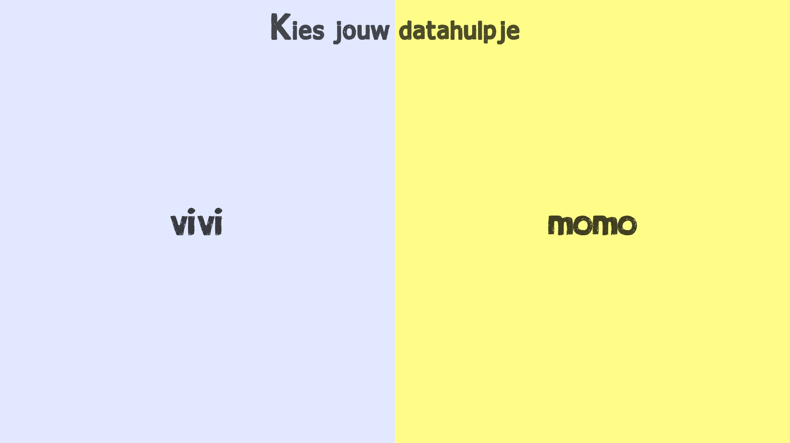

# Het datahulpje



[**Ga naar de website >**](https://qiubee.github.io/datacompanion/)

Vaak heb je het niet door, maar op het internet wordt heel veel informatie verstuurd. Ook jij deelt informatie zonder dat je er misschien weet van hebt. Daarom wilt de OBA jou meer inzicht geven over de informatie die de OBA van jouw als lid bewaard. Wil jij weten wat er met jouw informatie gebeurt? Dan is het datahulpje er om jou te helpen.

Het datahulpje neemt je mee in de wereld van informatie. Leer hoe informatie wordt verzameld en hoe je informatie deelt. Leer hoe je informatie aan kan passen en wat je met informatie kan doen. Het datahulpje geeft je een overzicht van jouw informatie, zodat je zelf kunt bepalen wat je met de informatie wil doen.

## Inhoud

1. [Installeren](#installeren)
2. [Hoe werkt het datahulpje?](#hoe-werkt-het-datahulpje)
3. [Features](#features)
4. [Optimalisaties](#optimalisaties)

## Installeren

Om het project te installeren, open de terminal en volg deze stappen:

**1. Kopieer repository:**

    ```bash
    # Kopieer de repository
    git clone https://github.com/qiubee/datacompanion-optimized.git
    
    # Navigeer naar de map
    cd datacompanion-optimized
    ```

**2. Installeer dependencies:**

    ```
    npm install
    ```

**3. Start server:**

    ```bash
    npm run start

    # Voor development
    npm run dev
    ```

**4. Open `localhost:8000` in de browser.**

## Hoe werkt het datahulpje?

1. Kies eerst jouw eigen datahulpje.
  
    Voor een persoonlijke ervaring kun je je eigen hulpje kiezen waarmee je jouw data gaat onderzoeken.

2. Speel mini-games om inzicht te krijgen over hoe de OBA informatie verzameld en gebruikt.

    Het datahulpje zal met een spel uitleg geven over hoe de OBA informatie verzameld en gebruikt. Dan zal het datahulpje jouw eigen informatie laten zien en geeft het jou de opdracht om de informatie veilig naar de OBA te sturen.

    Is de informatie veilig opgeslagen bij de OBA? Dan geeft het datahulpje met het laatste spel uitleg hoe je de informatie kunt aanpassen. Het datahulpje zal daarna weer de informatie zien die net is opgeslagen bij de OBA en geeft het jou de opdracht om de informatie aan te passen.

3. Bepaal welke informatie de OBA mag gebruiken en welke informatie je wilt delen.

    Krijg een overzicht van je eigen data en beslis zelf wat de OBA met de informatie mag doen. Sleep de informatie naar de kluis om het geheim te houden, bewaar de boeken die je geleend hebt bij de OBA, in je eigen boekenkast of scherm het af, en zie op basis van jou keuzes de aanbevelingen van de OBA veranderen.

## Features

* Kies je eigen datahulpje.
* Speel mini-games om te leren over hoe informatie wordt bewaard en hoe je het aanpast.
* Een informatiepagina waar je kunt kiezen welke informatie je wilt delen en wilt afschermen.
* Een aanbevelingenspagina die veranderd op basis van de informatie die jij gedeeld hebt.
* Praat met andere mensen over een boek als je het boek ook hebt geleend.

## Optimalisaties

* [Minimaliseren](#minimaliseren)
* [Browser toegankelijkheid](#browser-toegankelijkheid)
* [Comprimeren](#comprimeren)

### Minimaliseren

Met behulp van `gulp-uglify` worden alle client-side javascript bestanden geminimaliseerd naar een regel. Ook heb ik in het `build-js.js`-bestand alle javascript-bestanden samengevoegd tot één bestand. En met behulp van `gulp-csso` wordt het css bestand geminimaliseerd naar een regel.

### Browser toegankelijkheid

Met behulp van `gulp-babel` wordt de code getransformeerd naar code die voor oude browsers ook te begrijpen zijn.

### Comprimeren

Met behulp van `gulp-imagemin` worden alle afbeeldingen gecomprimeerd naar 50% van de kwaliteit voor JPG-afbeeldingen en worden de PNG-afbeeldingen gecomprimeerd tot [optimalisatielevel 4](https://github.com/imagemin/imagemin-optipng#optimizationlevel). Hiermee worden de afbeeldingen niet te groot van formaat.

## License

[**BSD-2-Clause**](LICENSE)
